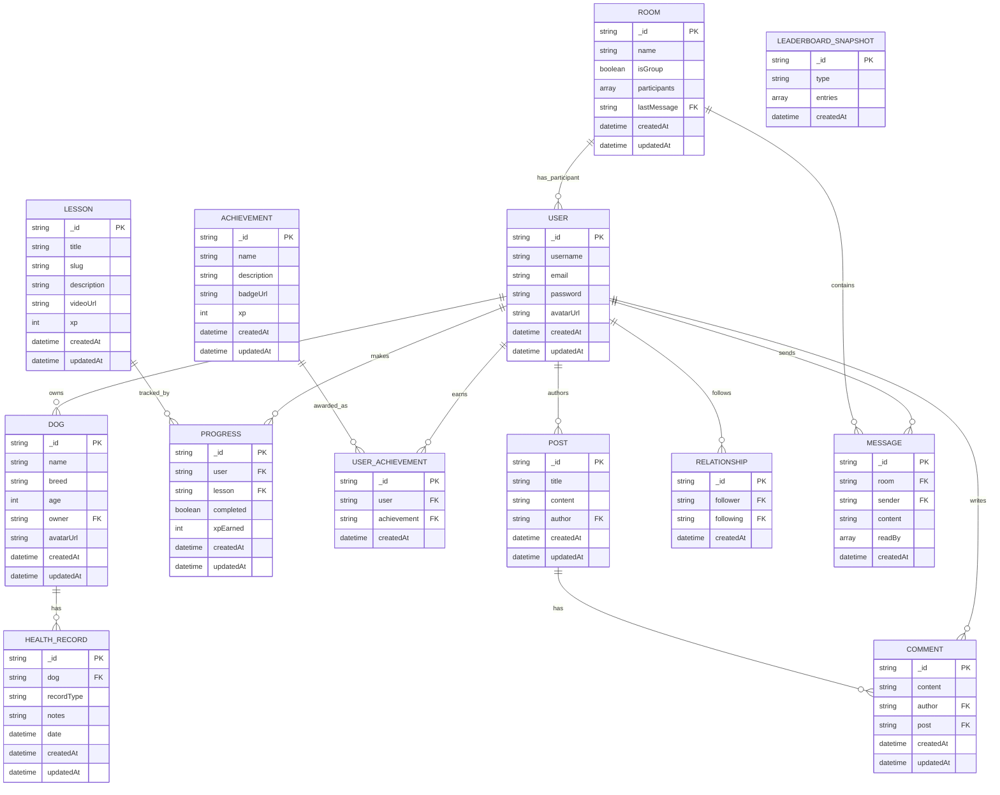

```mermaid
erDiagram
    USER ||--o{ DOG : owns
    USER ||--o{ PROGRESS : makes
    USER ||--o{ USER_ACHIEVEMENT : earns
    USER ||--o{ POST : authors
    USER ||--o{ COMMENT : writes
    USER ||--o{ RELATIONSHIP : follows
    USER ||--o{ MESSAGE : sends
    DOG ||--o{ HEALTH_RECORD : has
    LESSON ||--o{ PROGRESS : tracked_by
    ACHIEVEMENT ||--o{ USER_ACHIEVEMENT : awarded_as
    POST ||--o{ COMMENT : has
    ROOM ||--o{ MESSAGE : contains
    ROOM ||--o{ USER : has_participant

    USER {
        string _id PK
        string username
        string email
        string password
        string avatarUrl
        datetime createdAt
        datetime updatedAt
    }

    DOG {
        string _id PK
        string name
        string breed
        int age
        string owner FK
        string avatarUrl
        datetime createdAt
        datetime updatedAt
    }

    LESSON {
        string _id PK
        string title
        string slug
        string description
        string videoUrl
        int xp
        datetime createdAt
        datetime updatedAt
    }

    PROGRESS {
        string _id PK
        string user FK
        string lesson FK
        boolean completed
        int xpEarned
        datetime createdAt
        datetime updatedAt
    }

    ACHIEVEMENT {
        string _id PK
        string name
        string description
        string badgeUrl
        int xp
        datetime createdAt
        datetime updatedAt
    }

    USER_ACHIEVEMENT {
        string _id PK
        string user FK
        string achievement FK
        datetime createdAt
    }

    HEALTH_RECORD {
        string _id PK
        string dog FK
        string recordType
        string notes
        datetime date
        datetime createdAt
        datetime updatedAt
    }

    POST {
        string _id PK
        string title
        string content
        string author FK
        datetime createdAt
        datetime updatedAt
    }

    COMMENT {
        string _id PK
        string content
        string author FK
        string post FK
        datetime createdAt
        datetime updatedAt
    }

    RELATIONSHIP {
        string _id PK
        string follower FK
        string following FK
        datetime createdAt
    }

    MESSAGE {
        string _id PK
        string room FK
        string sender FK
        string content
        array readBy
        datetime createdAt
    }

    ROOM {
        string _id PK
        string name
        boolean isGroup
        array participants
        string lastMessage FK
        datetime createdAt
        datetime updatedAt
    }

    LEADERBOARD_SNAPSHOT {
        string _id PK
        string type
        array entries
        datetime createdAt
    }
```
